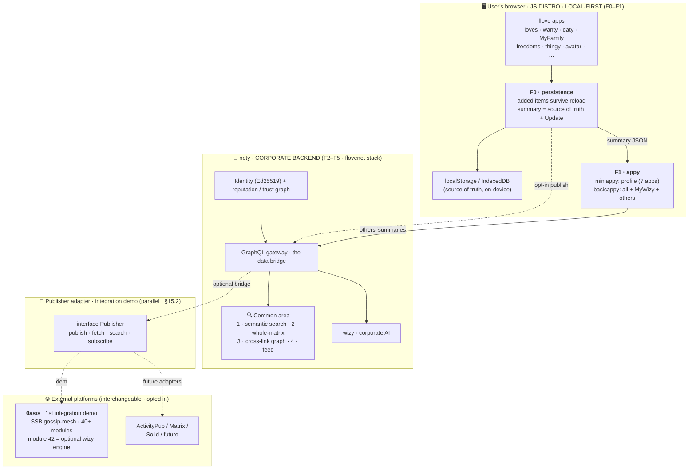
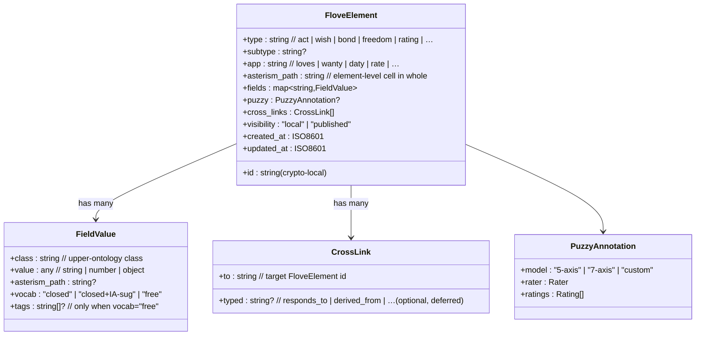
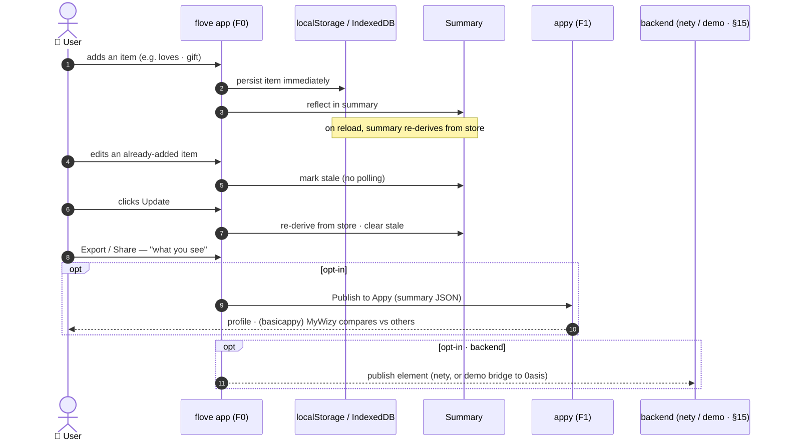
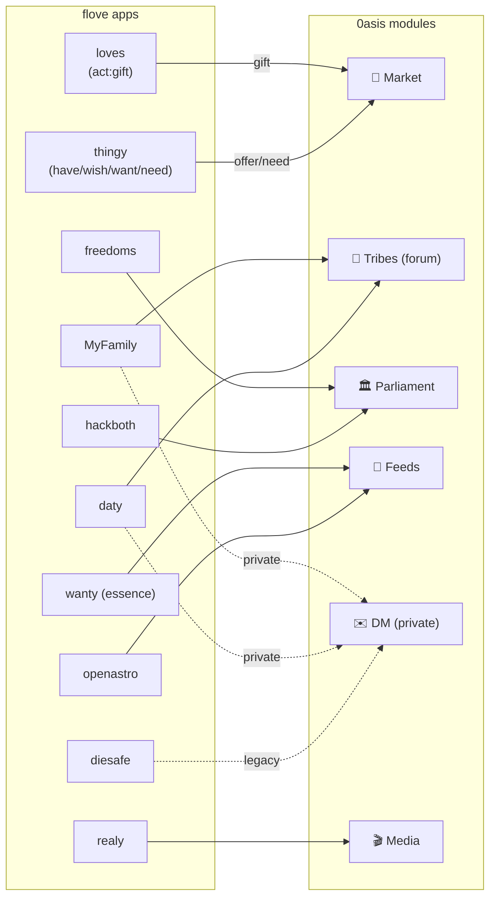
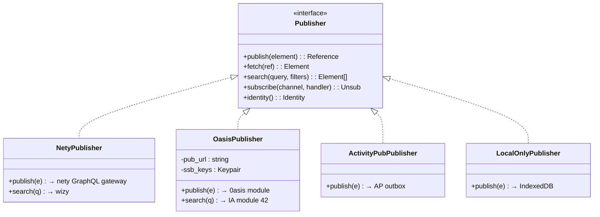
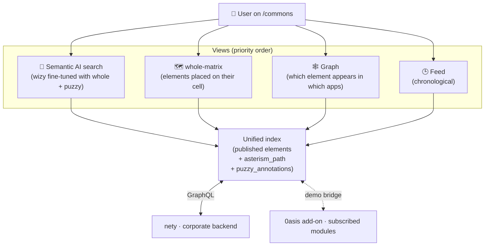
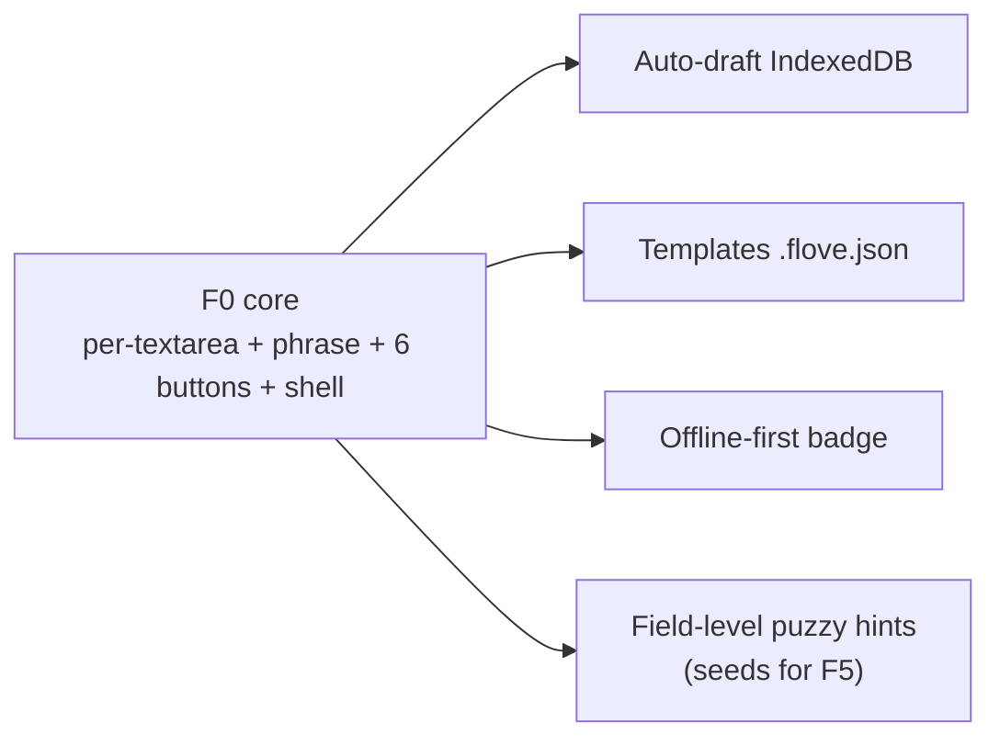
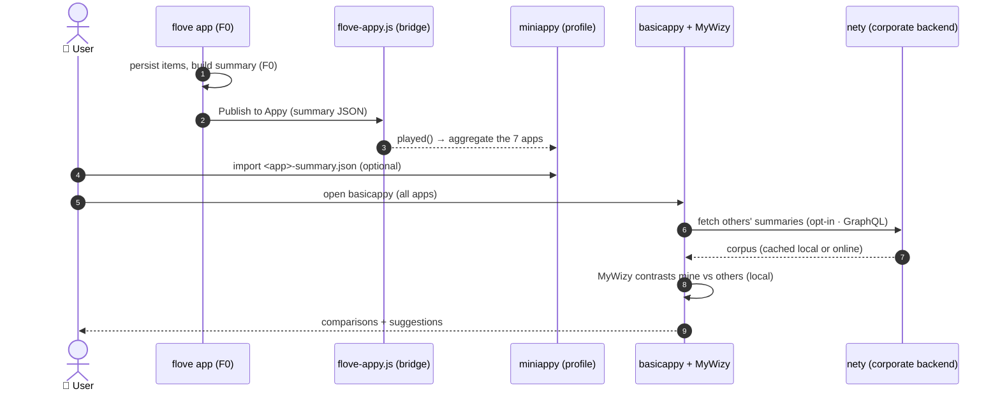
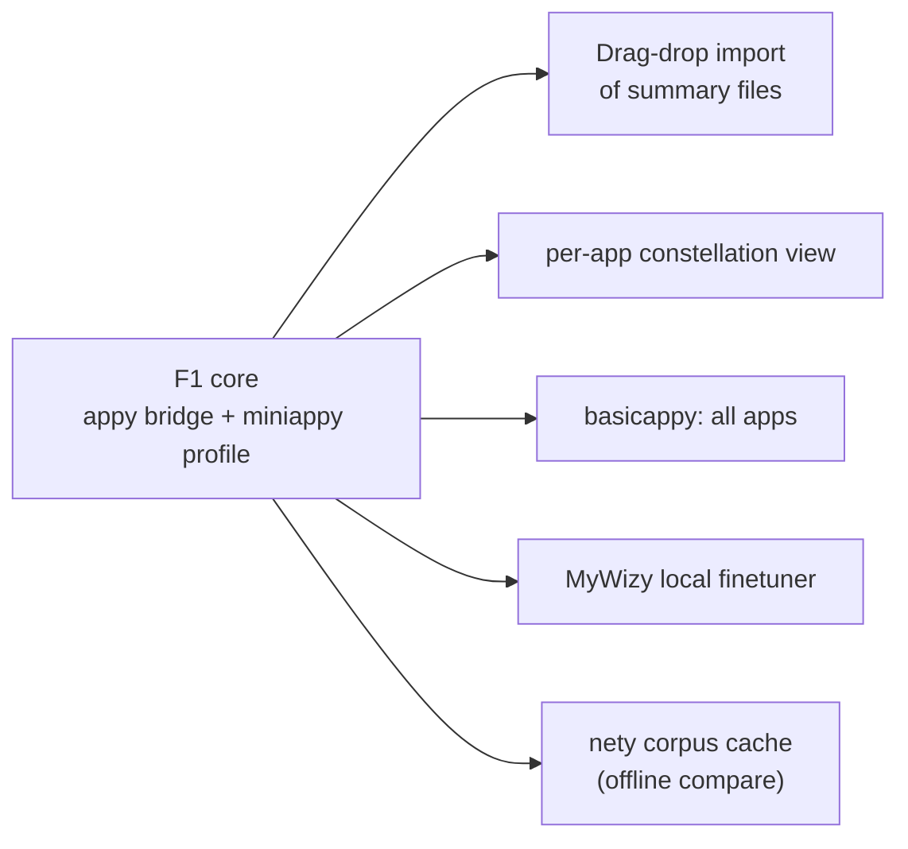
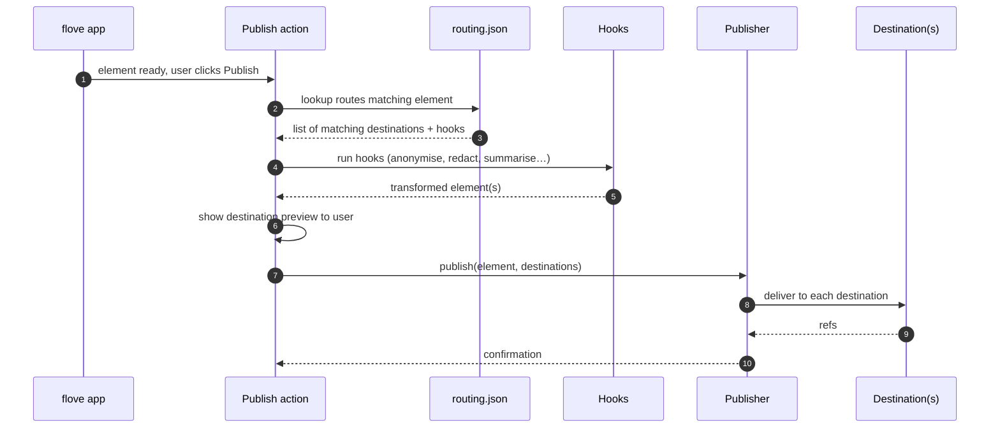

# ✺ flove · Specification & Backend Roadmap

> **Quick map:** for the concise, frontend-first picture see `overview.md`;
> this file is the deep reference.

> Living document.  Captures the project's **coordinate system**
> (four-tree taxonomy locating any flove unit of work) and the
> **design decisions, architecture and phased roadmap** for turning
> the constellation of flove demos into a portable, local-first system
> that can publish to **0asis** and to other distributed platforms in
> the future.

Status: **draft v0.3** · Owner: Marc · Updated: 2026-06-25

---

## A · Coordinate system → `coordinates.md`

> The four-tree coordinate system (Standards `o` · Tools `t` · Community `c` ·
> Usability `u`, **§A.1–§A.7**) now lives in its own chapter,
> **`coordinates.md`**. The `§A.x` labels are unchanged.

---

## 0 · Executive summary

**flove** is a local-first constellation of small client-side apps
expressing a relational worldview ("flow + love").  This plan turns
that constellation into a backed-by-the-network experience **without
breaking its local-first nature**.

Two principles drive every decision:

1. **Local-first.** Nothing leaves the user's device unless they
   explicitly publish. Each app **persists what you add** (it survives
   reload / close / reopen), the summary is the source of truth you
   **export "as you see it"**, and an **Update** button reconciles
   edits — no background polling.
2. **A corporate backend, plus portability.** flove's own backend is
   **`nety`** (on the flovenet stack), which serves the community side.
   flove stays a *portable semantic layer*: a `Publisher` adapter also
   lets it **integrate into existing external backends** — [**0asis**](https://0asis.net)
   first (a demo), then ActivityPub / Matrix / Solid. 0asis is an
   add-on, not the corporate backend.

The plan runs on **three strands** (§9, detail in §15): the **JS distro**
that ships today — **F0** = the **`mini` tier + its `minifull` variant**
of every app, fully-local + persisted (the `miniappy`/`minifull` profiles
aggregate your own summaries offline), and **F1** = the **`basic` tier** +
light enrichment (query the *local* AI **`MyWizy`** + punctual content
download). *(Tiers = horizontal stepper; `-full`/`-raw`/`-one`/`-css`
variants = vertical axis — §13.1.)* The **`nety` corporate backend** (**F2–F5**)
that serves identity, the common area, the global AI (**wizy** of Athenea)
and puzzy aggregation; and the parallel, deferred **external-platform
integration demo** (0asis et al.).

The end-state is a **polysemic dictionary** built from the bottom up:
every published element becomes a multi-rated, multi-related object
in a community-curated vocabulary, searchable via an AI fine-tuned on
the flove corpus (the **Whole** taxonomy in `docs/index.html` + the puzzy
primitives).

---

## 1 · Decisions already closed

| # | Topic | Decision |
|---|---|---|
| 1.1 | Accounts | No registration to use; an account appears **only when publishing** |
| 1.2 | Puzzy protocol | A multi-dimensional, relational, polysemic annotation system on user-defined objects (1–7 bipolar scales × 7 axes × sensory meta-raters × multi-rater aggregation × polarity / confluence / triad / combo primitives × WISE epistemic framework) |
| 1.3 | Corporate backend | **`nety`** — flove's own backend, on the flovenet stack (Ed25519 identity, reputation / trust graph, resources, GraphQL gateway). *Updated 2026-06-23:* nety is the corporate backend; **0asis is no longer "the backend of reference"** but the **first integration demo** (§1.7) |
| 1.7 | External-platform integration | **0asis.net** (and later ActivityPub / Matrix / Solid) is an **optional add-on / integration demo** reached via the `Publisher` adapter — proving flove plugs into existing backends. Not a runtime dependency of the corporate backend |
| 4.1 | What is an "element" | A **puzzy object** OR a **person/bond** |
| 4.2 | Cross-app sharing | **Common pool** PLUS **direct field-to-field cross-links** between specific apps |
| 4.3 | Common area priority | Semantic AI search → whole-matrix → graph → feed |
| 4.4 | Traceability scope | Only over **published** elements.  Local data never crosses out of the browser |
| 5.1 | Forms quick-win | All of: persist, export/import, cross-link, publish |
| 5.3 | Local persistence (F0) | Each app **persists added items across closing & reopening** the file/tab, but a **Reload or Reset always starts fresh** (they override persistence — see §10.3a); the summary re-derives from store + an **Update** button; export "what you see" — the user owns the data on-device (supersedes the old Copy/Save/Share framing) |
| 5.4 | Cross-link example (canonical) | A `loves` act of type *gift* surfaces in a **Market** view served by nety; the 0asis-Market mapping is the integration **demo** |
| 6.1 | What nety brings | Corporate backend on the flovenet stack: Ed25519 identity + encrypted keystore, reputation → 4 derived facets, trust graph (2nd-order + decay), resource roles + scheduler, GraphQL gateway as the data bridge |
| 6.1b | What the 0asis add-on brings (demo) | Identity (crypto-local), storage (ssb-blobs), federation (gossip mesh), 40+ feature modules, public PUBs — opted in via the `Publisher` adapter, not required |
| 6.2 | AI strategy | nety ships **wizy** (corporate AI), fine-tuned with the flove corpus, for **search** + **suggestions**. 0asis's **module 42** is usable as an *optional* wizy engine when the add-on is installed. (Local **`MyWizy`** in F1 is a separate, on-device finetuner.) |
| 6.3 | Visibility model | Private-first on nety (default inversion vs SSB public-default); local until the user publishes |
| 6.4 | Additional thematic views | **Messages** (DM) and **Forum** (circles/tribes) served by nety; the 0asis add-on can bridge to SSB tribes/DM as a demo |
| 7   | Scope of flove vs nety vs 0asis | flove is a **portable semantic layer**; **nety** is its corporate backend; **0asis** (and AP / Matrix / Solid) are interchangeable **integration demos**, not the only possible target |

---

## 2 · Architecture overview



**Key:** the dotted `opt-in publish` arrow is dotted because publishing
is always a deliberate user act — local data is never auto-uploaded. The
**corporate backend is nety**; the Publisher adapter and 0asis are an
**integration demo** (§15.2), not a runtime dependency.

---

## 3 · The flove element

A single schema flows through every app, every adapter, every view.
Section 3 fixes both the **upper ontology** (what kinds of things
exist) and the **wire shape** of a `FloveElement` used by the F0
persistence layer, the `appy` profile (F1), the `nety` corporate backend
(common area) and — on the integration-demo track — the Publisher adapter.

### 3.1 · Upper ontology — universal classes

Every concrete app field maps to one of a small set of universal
classes. Apps may add their own subclasses, but the upper classes are
the only thing the common-area views, the cross-link graph and module
42 are required to understand.

| Class      | What it represents                                  | Example emitting apps              |
|------------|-----------------------------------------------------|------------------------------------|
| `Act`      | An action performed by a person on/with something   | loves (gift), thingy (offer)       |
| `Wish`     | A desire / pending act                              | thingy (need/want), wanty (essence)|
| `Bond`     | A relationship between two persons                  | MyFamily, daty                     |
| `Place`    | A spatial location (point or region)                | openastro, MyFamily, daty          |
| `Person`   | A human (self or other), pseudonymous OK            | MyFamily, daty, avatar             |
| `Time`     | A point or interval in time                         | daty, openastro, realy            |
| `Object`   | A thing/concept being rated or referenced           | rate, realy                       |
| `Freedom`  | A declared right or boundary                        | freedoms, hackboth, diesafe        |
| `Rating`   | A puzzy annotation (see §8)                         | rate, any other app via attach     |

Mapping rule: every leaf field of every app declares which universal
class it carries. This is what lets the common area treat fields from
different apps as queryable peers.

### 3.2 · Per-app mapping

Each app ships a small `mapping.json` next to its HTML that declares,
for every field name, which upper class the field carries:

```json
{
  "app": "loves",
  "type": "act",
  "subtype": "gift",
  "fields": {
    "from":    { "class": "Person", "vocab": "person",  "free_tags": false },
    "to":      { "class": "Person", "vocab": "person",  "free_tags": false },
    "thing":   { "class": "Object", "vocab": "object",  "free_tags": true  },
    "context": { "class": "Place",  "vocab": "place",   "free_tags": false },
    "motive":  { "class": "Wish",   "vocab": "essence", "free_tags": false }
  }
}
```

This file is the bridge between the app's free-form HTML and the
upper ontology; the F0 persistence layer reads it to populate
`FloveElement.fields` correctly.

### 3.3 · Vocabulary policy

Three vocabulary modes, declared per field in `mapping.json`:

| Mode              | Meaning                                                          | Updateable by                  |
|-------------------|------------------------------------------------------------------|--------------------------------|
| `closed`          | Versioned canonical list; only project releases add terms        | flove release                  |
| `closed + IA-sug` | Same as closed but **wizy** may **suggest** new terms inline    | flove release (after curation) |
| `free`            | User-typed tags, no validation, indexed as-is                    | every user                     |

`free_tags: true` on a field opts that field into the `free` mode in
addition to its declared closed vocabulary. Module 42 suggestions are
always proposals — a release cycle decides whether they enter the
canonical list.

### 3.4 · `asterism_path` per sub-field

Every field carries its **own** coordinate inside the **Whole** taxonomy
(`docs/index.html`), not just the element as a whole. This lets a single element
appear simultaneously in several cells of the whole-matrix view (one
per field) and lets cross-link search hit the right granularity.

```json
{
  "asterism_path": "puzzy/relate/rate",
  "fields": {
    "subject": { "class": "Object", "value": "TRUE",
                 "asterism_path": "puzzy/relate/rate/subject" },
    "anchor":  { "class": "Object", "value": "LOVE",
                 "asterism_path": "puzzy/relate/rate/anchor" }
  }
}
```

### 3.5 · `FloveElement` schema (canonical)



The element snapshot persisted by F0 already follows the top-level
shape; what §3 adds is the per-field metadata, the upper class mapping
and the per-sub-field `asterism_path`.

---

## 4 · Element life cycle



---

## 5 · Routing (apps → backend modules)

> **Backend strands (deferred behind the JS distro).** §6 (Publisher
> adapter) and the routing below belong to the **external-platform
> integration demo** (§15.2); §7 (common area) is served by the **`nety`
> corporate backend** (§15.1). The module map below shows the **0asis
> demo** mapping — the same elements route to nety's own modules
> natively. Phased detail in **§15**.



This map lives as a **declarative `routing.json`** file, never as
hard-coded logic inside each app.

---

## 6 · Publisher adapter (portability)



One interface, several implementations. **`NetyPublisher` is the
corporate backend** (the default target); `OasisPublisher` /
`ActivityPubPublisher` are the **integration demos** showing flove plugs
into existing platforms; `LocalOnlyPublisher` is for tests. The app
never knows which one is running.

---

## 7 · Common traceable area

> Served by the **`nety` corporate backend** (§15.1). The 0asis add-on
> can mirror it as an integration demo, but the authoritative common
> area lives on nety.



---

## 8 · Puzzy engine → `puzzy.md`

> The puzzy engine (relational multi-axis / multi-rater annotation, **§8.x**)
> now lives in its own chapter, **`puzzy.md`**. The `§8.x` labels are
> unchanged. It ships in phase F5 (§9).

---

## 9 · Phased roadmap

The roadmap runs on **three strands** (detail in §15):

- **JS-distro track (F0–F1)** — the self-contained, here-and-now distro
  that ships today.
  - **F0 — fully local, zero network:** the **`mini` tier + its `-full`
    variant (`minifull`)** of every app, all with local persistence. Each
    app persists what you add (summary = source of truth for export). The
    matching appy profiles aggregate *your own* summaries locally
    (`miniappy` ≈ the 7 featured apps, `minifull` ≈ all apps). Fully offline.
  - **F1 — `basic` tier + enrichment:** the **`basic`** tier (`basicappy`)
    on top of the local profile — querying **`MyWizy`** (the *local* AI)
    for insights, plus **punctual content download** (pull a bit of
    external content on demand, e.g. a few others' summaries) and its
    extra features. Opt-in, minimal network; *not* the corporate backend.
  - *Tiers are the **horizontal** tier-pop stepper (mini · basic · normal ·
    advanced · super); the `-full`/`-raw`/`-one`/`-css` variants are the
    **vertical** axis shown under each step. F0 = `mini`+`minifull`,
    F1 = `basic`. See §13.1.*
- **`nety` · corporate backend (F2–F5)** — flove's **own** backend,
  built on the flovenet stack (Ed25519 identity, reputation / trust
  graph, resources, GraphQL gateway). It is what actually serves the
  social/community side **at scale**: the full *others'* corpus (F1 only
  pulls a little on demand), the common area, the AI (**wizy**) and puzzy
  aggregation. The upper layer is nety-native (§15.1).
- **External-platform integration · demo (parallel, deferred)** — proves
  flove plugs into **existing** backends: `routing.json` + the
  `Publisher` adapter bridging out to **0asis** (first demo), then
  ActivityPub / Matrix / Solid. 0asis is an *add-on / integration demo*,
  not the corporate backend (§15.2).

| Phase | Track | Main deliverable | Optional add-ons that fit this layer |
|---|---|---|---|
| **F0 · `mini` + `minifull` (local)** | JS distro | The **`mini` tier + its `-full` variant (`minifull`)** of every app, **persisted locally**. Added items survive reload / close / reopen; summary re-derives from store, **Update** re-syncs edits, export is "what you see". The appy profiles aggregate *your own* summaries locally (`miniappy` ≈ 7 featured apps, `minifull` ≈ all apps). Fully offline. | • IndexedDB for large sets · • drag-drop import of summary files · • per-app constellation view · • *stale* dot beside Update · • offline-first badge · • **private add-on** — `Enable login` High-locking (at-rest AES-GCM + crypter pass + recovery phrase + multiuser copied folders; §13.13, spec 2026-06-25) |
| **F1 · `basic` tier + features** | JS distro | The **`basic`** tier (`basicappy`) + enrichment: query **`MyWizy`** (the *local* AI) for insights / "near me · unlike me", plus **punctual content download** (pull a few others' summaries on demand to compare). Opt-in, minimal network. | • cached others-corpus for offline compare · • suggestion prompts · • on-demand reference pulls · • per-cell mini-summaries |
| **F2 · Identity + publish** | nety (corporate) | nety identity (Ed25519, derived from flovenet keystore) + a "Publish" button with destination preview | • Multiple pseudonyms ("masks") per context · • Element revocation · • Diff confirmation before publish · • Share via QR / ephemeral link |
| **F3 · Common area** | nety (corporate) | Semantic search + whole + graph + feed, served by nety (flovenet GraphQL gateway) | • Sense-based filters · • Permalink to a whole cell · • Activity heatmap per cell · • "Your footprint" personal view |
| **F4 · AI — wizy** | nety (corporate) | **`wizy`** = Athenea's global AI, trained with `whole` + puzzy seeds (module 42 usable as an *optional* engine via the 0asis add-on) | • Polarity suggestions while filling forms · • Auto-tagging of `asterism_path` · • Semantic duplicate detection · • Per-cell community summary |
| **F5 · Full puzzy engine** | nety (corporate) | Multi-axis ratings + multi-rater + primitives | • "Consensus vs dissent" view per object · • Temporal trajectories of a rating · • Rater reputation (un-gamified) · • Combo generator for creative inspiration |
| **— · External bridges** | integration demo | `routing.json` + `Publisher` adapter → `OasisPublisher` (first demo), then ActivityPub / Matrix / Solid | • Visual routing editor · • Pre-publish hooks (anonymise / redact) · • `LocalOnlyPublisher` / `MockPublisher` for tests · • Multi-publisher (nety + 0asis + AP at once) |

> Three distinct "AI"s, don't conflate: **`MyWizy`** (F1) is the **local**
> per-user finetuner over your own + imported summary JSONs; **`wizy`**
> (F4) is the **global** AI of **Athenea** — nety's corporate AI over the
> community corpus; **module 42** is 0asis's AI, usable only as an
> *optional* engine for `wizy` when the 0asis add-on is installed.

---

## 10 · F0 detail — JS distro · local persistence + Update + export

> **F0 is the foundation of the JS distro and runs entirely in the
> browser — zero network.** It gives every app three things: (1) the
> data the user *adds* survives reload / close / reopen, (2) the summary
> is the single source of truth that you export "as you see it", and
> (3) an **Update** button re-syncs the summary after in-session edits —
> no background polling. **F0 spans every app *and* the `miniappy` /
> `basicappy` profiles**, which aggregate your own summaries locally
> (detail in §11; the MyWizy / download enrichment on top is F1). The
> earlier `flove-io.js` / `flove-shell.js` module framing is **superseded**
> by this section; the same element shape and form surface survive, the
> persistence + Update loop is new.

### 10.1 · Goal

Make every flove app **own its data locally and durably**: what you add
stays, what you see in the summary is exactly what exports, and editing
something already added is reconciled by one explicit **Update** — with
**zero build step**, **no framework dependency**, and **nothing leaving
the device**.

### 10.2 · Design constraints

- **Vanilla JS** (or small inline script per the tier model §13.1).
  Works in any modern browser straight from the page. No bundler, no
  transpiler.
- **Zero dependencies, zero network.** Web platform APIs only
  (localStorage, IndexedDB, Blob/URL, Web Share, Clipboard,
  SpeechRecognition). F0 never calls out.
- **Progressive enhancement.** Any unsupported API hides its UI hook
  silently — the rest still works.
- **Persistence is the default, not an add-on.** Added items are
  written to storage as they are added; the app rebuilds its state from
  storage on load.
- **No polling.** State is reconciled on explicit events (load, add,
  Update click), never on a timer.

### 10.3 · The pieces

1. **Persistence layer** — added items written to `localStorage`
   (or IndexedDB for large/structured sets), keyed per app; rehydrated
   on load. §10.3a.
2. **Summary as source of truth** — re-derived from storage on load and
   on Update; what it shows is what every export format emits (§13.9,
   §13.12).
3. **Update button + *stale* signal** — beside the summary; re-syncs
   after in-session edits to already-added items. §10.3a.
4. **Per-textarea controls** — 🎙 voice + ➕ add-another, injected per field.
5. **Live legible phrase** below the form.
6. **The action bar** on the phrase (Copy / Share / Magic / Insight /
   Publish / Format) — Publish degrades gracefully to local export when
   no backend (§15) is wired.
7. **Common HTML shell** so each app only writes its middle.

Everything works offline and stays on-device. Insight and Publish only
reach the network once a backend is wired (§15); until then they
degrade to local behaviour.

### 10.3a · Persistence model + the Update button

The problem F0 solves: if added items are persisted and the summary
froze a *snapshot* at add-time, then editing an already-added item would
not show in the summary — and you would be tempted to run a timer that
re-scans selections every few seconds. **That timer is rejected**: it
wastes CPU/battery, can fight the user mid-edit, and is against the
low-tech flove stance. The contract instead:

| Moment | What happens |
|---|---|
| **Add an item** | Item is written to storage immediately and pushed into the summary. |
| **Open / reopen the file/tab** | The state is **re-derived from storage**, so the user's choices persist across closing and reopening — the true current state always wins, never "first added wins". |
| **Reload** (F5 / the ⟳ logo) | **Starts fresh — overrides persistence.** Our own keys are dropped and nothing is restored, so any intro animation replays and the form returns to its step-1 state. |
| **Edit an already-added item** (same session) | The store is updated; the summary may now be *stale* relative to what's shown. A subtle **`stale` dot** lights beside **Update** (set on the edit event — no polling). |
| **Click Update** | The summary re-derives from storage; the `stale` dot clears. |
| **Click Reset** | **Starts fresh — overrides persistence, same as Reload** (behind a confirm): clears **only this app's** stored items (`flove:<app>:*` keys — never other apps' data, §10.5) and reloads, so the form empties *and* the intro replays. |
| **Export / Share** | Emits exactly the current summary — "what you see is what you export" holds by construction. |

**Reload/Reset vs. reopen — the rule.** Persistence is for *coming back*:
close the file and open it again → your choices are restored. But a
**Reload** or **Reset** means "start over" → the app clears its own keys
and re-derives an empty step-1 view (any intro animation replays). Tell the
two apart with the **Navigation Timing API**: `performance.getEntriesByType(
'navigation')[0].type === 'reload'` → wipe + fresh; any other entry
(`navigate` / `back_forward` — a genuine open or reopen) → restore. Reset
does the same by clearing keys then calling `location.reload()`, so it lands
on the same fresh branch. Reference implementation: `apps/bio/varyy.html`
(`navIsReload()`). Caveat: *reopen-closed-tab* / session-restore can report
as `reload` in some browsers and thus wipe — a genuine fresh open is safe, so
key only off an explicit `'reload'`.

**Scope of the wipe = the app's own keys.** Clear exactly the keys Reset
clears — the content/summary keys (and an app-namespaced onboarding/"seen"
flag, if it lives among them) — so reload and reset stay in lock-step and any
first-run intro/onboarding replays (this *is* the "start the animation again"
intent). Never touch cross-app keys: the shared language default
(`flove:lang` / `translate2-lang`) and display prefs (e.g. compass mode) must
survive a reload. If a specific app should keep an onboarding hint *dismissed*
across reloads, drop only that flag from the reload branch (keep it in Reset)
— an intentional per-app exception, not the default. Propagated across the F0
summary apps (goddy · willy · souls · maty · myfamily · keys-advanced · realy
· pracsys · worthing · dealy-advanced · inventary · blogy-advanced) + varyy;
apps with no Reset control (willy, dealy-advanced) get the load-gate only.

So the loop is: *add → see it in summary → (edit → Update if needed) →
export what I see*, with no background reviewer. Storage key convention:
`flove:<app>:items` (mirrors `flove:appy:played` used by the appy bridge,
§11).

**Inline vs `flove.js` — graded by tier (§13.9).** The persistence +
**Update** + **Reset** trio comes from one canonical *source* in
`flove.js`, but where it physically lives depends on the tier:

- **`mini`** — **inlined, no `flove.js`.** The trio ships inside the file
  so a `mini` stays a self-contained single page that works on `file://`.
- **`basic`** — **either** (inline or `../flove.js`), per app.
- **`normal` / `advanced`** — **load `../flove.js`** (external) for sure;
  the modular build is the point at that tier.

**Status: delivered** — the loop is live across the summary apps:
`metas/goddy · willy · souls`, `trusty/maty · myfamily`,
`puzzy/keys-advanced`, `realy`, `bio/pracsys`, `economy/worthing ·
dealy-advanced · inventary`, `blogy/blogy-advanced`. This is **not** the
pending item §10.14 once listed.

### 10.3b · Which local-persistence method (and the risks)

"Persist locally" is **three layers**, not one store. Pick by role:

| Layer | Role | Method | When |
|---|---|---|---|
| **1 · Hot store** | what persists while you use the app | **`localStorage`** | **default for every app.** Key-value, synchronous (fine for KB), trivial API, ~5–10 MB/origin. Keys: `flove:<app>:items` + `flove:<app>:v` (schema version). |
| **2 · Durable archive** | the *real* backup | **export files + `appy` → `nety`** | always. Layer 1 is **not** durable (see risks); the export ("what you see") and the profile upload are the lasting copy. |
| **3 · Escalation** | large / binary / queryable | **IndexedDB** | **only if** an app stores binaries (images / audio / files), many MB, or needs indexed queries over thousands of records. No current app (Keys included) needs it. |

Optional nicety: the **File System Access API** can offer a "save to my
disk" that writes a real `.json` the user owns (Chromium; elsewhere it
falls back to the normal download). **Do not use** `sessionStorage`
(cleared on tab close), cookies (tiny, sent to server) or OPFS
(over-built for KB JSON).

> **One-line rule:** localStorage by default · export/appy = the real
> backup · IndexedDB only for binaries / MB / queries.

**Why layer 2 is non-negotiable — the risks of "max local persistence":**

| Risk | Mitigation |
|---|---|
| **Not durable.** Browsers can evict local storage under disk pressure, in private mode, or after inactivity (Safari/ITP expires script-written storage after ~7 days without interaction). | Treat local as a **cache**; the export + `appy`/`nety` upload are the archive. Optionally call `navigator.storage.persist()` to reduce eviction. |
| **Shared per-origin quota.** All flove apps on one origin (`flove.org`) **share the same ~5–10 MB** — they compete, not one quota each. | Real budget is tiny: a Keys summary is ~2–10 KB, 20 apps ≈ <1 MB, so headroom is large. Watch it only if media ever enters (→ IndexedDB). |
| **`QuotaExceededError` on write.** A full quota makes `setItem` throw; an uncaught throw silently loses the write (and maybe the edit). | Wrap every write in `try/catch`; on failure, warn the user and point to export. |
| **Synchronous + string-only.** `JSON.stringify` + write blocks the main thread; large blobs cause jank and slow startup. | Keep layer 1 to small structured JSON; move anything big/binary to IndexedDB (layer 3). |
| **No cross-device, no backup.** Clearing data, switching browser/device = data gone. | Layer 2 again: export / profile is the portable copy. |
| **Schema drift.** Old persisted data may not match newer app code → corrupt reads. | The `flove:<app>:v` version key + defensive parse + a small migration step. |
| **Shared computers / privacy.** Data lingers on the machine. | A clear "clear my data" control + a privacy note. |

**F0 persistence plan — `mini` & `mini-full` (no backend).** Both are F0
local **profile** builds, so both persist and both aggregate across apps;
the difference is *how many*: **`mini` = the 7 featured apps (the
`miniappy` profile), `mini-full` = *all* apps (the `minifull` profile,
§11.4).** Five features, none requiring a server — the regime (`file://`
vs `localhost`, §10.3c) decides how strong each can be:

| # | Feature | What it does | `mini` | `mini-full` |
|---|---|---|:---:|:---:|
| 1 | **Robust hot store** | `localStorage` keyed `flove:<app>:items` + `flove:<app>:v`; every write in `try/catch` (`QuotaExceededError` → warn + point to export); defensive parse + version migration; a **"clear my data"** control. | ✅ (aggregate over the 7) | ✅ (aggregate over all apps) |
| 2 | **Open over `localhost`** | ship + recommend the launcher (§10.3c); flips `localStorage` from *unreliable* (`file://`) to *reliable*, and unlocks the secure-context APIs below. | ✅ | ✅ |
| 3 | **`navigator.storage.persist()`** | request persistent storage so the browser won't evict under disk pressure / inactivity (counters Safari ITP ~7-day expiry). No-op off a secure context. | ✅ | ✅ |
| 4 | **File System Access** | "save to / open from my disk" — the data lives in a real `.json` the user owns, surviving browser-data clears and browser switches (Chromium; elsewhere falls back to download + import #5). | optional | ✅ (one file = the whole profile, all apps) |
| 5 | **Export ↔ Import round-trip** | the §13.12 JSON export is the **durable archive** (layer 2); add an **`<input type="file">` import** to read it back — works even on `file://`, so a shared single file regains its data. | import optional | ✅ (the file is the *whole-constellation* profile) |

**Floor:** feature 5 (export + file-input import) is the one durable
path that needs no backend *and* no localhost — it works on `file://`
too, so it is the baseline both builds must keep. Features 1–3 make the
*hot* store trustworthy; feature 4 is the strongest no-backend durability
where Chromium + a secure context are available. Both profiles' store,
export and import span **multiple apps** — `mini` over the **7 featured**
apps, `mini-full` over the **whole constellation** — never a single app.

### 10.3c · Serving locally — `file://` vs `http://localhost` + the launcher

Where F0 persistence actually *works* depends on **how the app is opened**.
This is the practical companion to §10.3b.

**`file://` (double-click the `.html`)** — zero setup, ships as one file, works
offline, great for a quick demo. But the origin is opaque/null, so: `localStorage`
**is not reliable across sessions** (browser-dependent), ES modules / `fetch()`
are blocked, cross-document SVG `<use href="other.svg#id">` is blocked (why flove
inlines its SVG marks), Service Workers are impossible, and secure-context APIs
(Clipboard / Web Share) are inconsistent.

**`http://localhost` (a local server)** — `localStorage` / IndexedDB **persist
reliably**, modules / `fetch` / external SVG `<use>` work, and localhost is a
secure context (so Clipboard, Web Share, `storage.persist()`, Service Workers are
available). It is the same shape as production (`flove.org` is http(s)).

| | `file://` | `http://localhost` |
|---|---|---|
| Setup | zero (double-click) | start a server |
| Share the `.html` | ✅ trivial | ❌ only you |
| localStorage persists | ⚠️ unreliable | ✅ reliable |
| ES modules / fetch | ❌ blocked | ✅ |
| external SVG `<use>` | ❌ (hence inline) | ✅ |
| Service Workers / PWA | ❌ never | ✅ |
| Clipboard / Web Share | ⚠️ browser-dependent | ✅ |
| = production shape | ❌ | ✅ |

**Rules:**

- **Develop and test over `http://localhost`** (it matches `flove.org` and is
  where F0 persistence actually holds). Treat `file://` as best-effort.
- **Keep apps from breaking on `file://`** anyway — inline SVG/CSS/JS, use
  classic (non-module) scripts, and assume storage *may* not persist there. The
  double-click stays valid for showing a single app.
- **End users → `flove.org` (https):** persistence + secure context + shareable.

**The portable launchers (ship in the download, one per OS).** So a
non-technical user gets localhost with one click, the download package carries
per-OS launchers **at the zip root, beside the `flove/` folder**. They are
**generated by `build-flove-zip.sh`, not tracked** in the repo (detail in
§10.3d) — so there is no loose `start-flove.sh` / `.desktop` at the repo root.
Each serves the sibling `flove/` folder on `python3 -m http.server 8642` (if not
already up) and opens the entry page `http://localhost:8642/START.html` (the
language selector — `START.html` is `launch.html` renamed for the download);
from there every relative link keeps the whole constellation on localhost.

- `START-FLOVE-LINUX.sh` — self-locating (`readlink -f` → its own folder), and
  on **first run** it also drops a `flove (localhost)` icon into the
  applications menu + Desktop (pointing back at itself), so next time you launch
  from there. No `.desktop` is shipped — it creates its own.
- `START-FLOVE-MAC.command` — double-click opens Terminal (macOS lacks
  `readlink -f`, so it locates its folder the simple way and uses `open`).
- `START-FLOVE-WINDOWS.bat` — tries `python` then `py`; if neither, opens the
  file directly.
- `START-FLOVE-MOBILE.html` — phones can't run a launcher/server, so this is a
  page that redirects to `flove/START.html` over `file://` (offline, degraded).
- **Fallback (desktop):** if the server can't come up (no `python3`, port
  blocked), the launcher opens `file://…/START.html` instead (degraded — persistence
  may not save) rather than a dead localhost.
- **Distribution caveat:** the launcher scripts are "untrusted" — the OS may ask
  to mark them executable / "Allow" on first run (document in the README).
  Desktop launchers require `python3`.

### 10.3d · Shipping the distro — live site (`update-web`) + download package (`flove.zip`)

Two distribution mechanisms move the JS distro out to users, and **both
operate on the _committed_ state, never the working tree** — commit via the
Gitea workflow first; in-progress edits ship in neither. Do **not** confuse
either with the semantic **`Publisher`** adapter (§6 / §15), which ships user
*elements* to a backend (nety / 0asis). These two ship the *site / app code
itself*.

**A · The live site — `flove.org` via GitHub Pages (the `/update-web` skill).**

- **Topology:** local `~/Documents/flove` (source of truth) → Gitea
  `localhost:3000/marc/flove` (`main`) → GitHub `floveorg/floveorg.github.io`
  (`main`, root folder) → GitHub Pages → **flove.org** (rebuilds ~1 min). The
  main repo is the **org site** (`floveorg/floveorg.github.io`, holds the
  `flove.org` `CNAME`), so project repos under `floveorg` serve at
  `flove.org/<repo>`.
- **What the skill does:** it only **mirrors** committed `main` to GitHub —
  publishing ≠ authoring. It never `git add`/`commit`s; uncommitted or
  untracked files do **not** publish. Belt-and-suspenders it `--ff-only`
  merges `origin/main` (Gitea) first and STOPs on any divergence.
- **Auth + guardrails:** a fine-grained GitHub PAT (Contents R/W on
  `floveorg.github.io`) lives in `~/token-github-flove.md`; used **inline**,
  never persisted in `.git/config`, never printed. Push `main` only, never
  `--force`. Pages serves `main` verbatim — static, **no server-side
  rewrites** (repo root carries `CNAME` = `flove.org` + `.nojekyll`).
- **Scope = MAIN SITE only.** Two siblings publish on their own, not here: the
  **blog** (separate repo `marc/blog` nested at `flove/blog` →
  `floveorg/blog` via `blog/build-blog.sh publish`; drafts stay private) and
  **LowAI** (`apps/lowai` → `lowai.org` via `publish-lowai.sh` →
  `LowAiorg/web`).

**B · The download package — `flove.zip` (`build-flove-zip.sh`).**

- **What it is:** the runnable **offline copy** the home-page "Download / Go
  local" button hands out (also the no-JS fallback for the PWA "Install"
  button, `index.html`).
- **Source of truth = `git archive HEAD`** — exactly the committed site
  flove.org serves, so no `.git`, CI, or gitignored dev cruft. Commit before
  building.
- **Stripped** as meaningless offline: `flove.zip` itself, the build scripts
  (`build-flove-zip.sh`, `build-sw.mjs`, `build-aliases.mjs`), `404.html`,
  `CNAME` + `.nojekyll`, `.gitignore` + `.htmlvalidate.json`; plus web-only
  extras `blog/`, `docs/superpowers` (dev specs), `apps/lowai`,
  `apps/ephemerall`, `apps/anim-form.html`.
- **Entry rename:** `launch.html` → `START.html` in the download (the live
  site keeps `launch.html`); `manifest.webmanifest` + `sw.js` are rewritten to
  match, and the download's landing stays the **language selector on every
  launch** (the live site's auto-skip-when-remembered line is dropped).
- **Per-OS launchers at the zip root** (generated, **not tracked** in the
  repo — these are the launchers of §10.3c): `START-FLOVE-LINUX.sh` (also drops a menu/Desktop icon on first
  run), `START-FLOVE-MAC.command`, `START-FLOVE-WINDOWS.bat`, and
  `START-FLOVE-MOBILE.html` (phones can't serve — opens `flove/START.html` via
  `file://`, degraded). Each serves the sibling `flove/` folder on
  `localhost:8642` and opens `START.html`, falling back to `file://` if
  `python3` is absent — same localhost-vs-`file://` trade-off as §10.3c.
- **Per-app cube downloads** (`apps/index.html`, e.g. `goddy.zip`,
  `astry.zip`) are the intended single-app sibling of this whole-distro
  package — **planned, not yet generated** (no per-app builder exists yet).

### 10.4 · Per-textarea controls

Every `<textarea>` (and every text-like `<input>`) inside a flove
form gets two small controls injected by the shell:

| Glyph | What it does |
|-------|--------------|
| 🎙️    | Web Speech API recording. Click to start, click to stop. Final transcript is appended (leading space if non-empty). State: `is-recording` class while live; visible pulse from CSS. |
| ➕    | Adds another input of the same logical field. Keeps focus on the new one. |

The voice button is hidden if `SpeechRecognition` is unsupported. The
add-another button is hidden if the field declares
`data-flove-multi="off"`.

#### 10.4.1 · Multi-value naming — both modes supported

Set on the field, or on the form as a default:

```html
<!-- per-field -->
<textarea name="what" data-flove-multi="numbered"></textarea>

<!-- form-wide default -->
<form data-flove-app="loves" data-flove-multi="array"> … </form>
```

Default if neither is declared: `numbered`.

**Numbered mode:** first clone keeps the base name; subsequent clones
append `_2`, `_3`, … Snapshot keys stay flat (`what`, `what_2`,
`what_3`). Best for forms that read like spreadsheets.

**Array mode:** all fields share `baseName[]`. Snapshot collapses them
into an array. Best for clearly list-shaped fields (tags, ingredients,
attendees).

`readFormFields` handles both deterministically:
- `name="x"` once → scalar at `x`.
- `name="x"` repeated → auto-array at `x`.
- `name="x[]"` (any count) → array at `x`.
- `name="x.y"` → nested at `x.y` (dotted-path support).

### 10.5 · Live legible phrase

A read-only block sits **below** the form, always visible, updated on
every keystroke:

```
✺ <app>/<type>(<subtype>) · <key>: <value> · <key>: <value> · yyyy-mm-dd
```

Multi-value fields render as one clause each (numbered) or comma-joined
(array). Empty fields are skipped. The phrase block shares a card with
the action bar so it's clear the buttons act on what's shown.

### 10.6 · The six-button action bar

One row, six buttons, attached to the phrase block. Glyph + label on
desktop; glyph only on narrow viewports. Order is fixed.

| # | Glyph | Label   | Default behavior                                     | Long-press / Shift |
|---|-------|---------|------------------------------------------------------|--------------------|
| 1 | 📋    | Copy    | Copies the current phrase to clipboard.              | Copies the JSON.   |
| 2 | 📤    | Share   | `navigator.share({ text: phrase, files: [json] })`   | Phrase only.       |
| 3 | 🪄    | Magic   | Rewrites the phrase with random prepositions before each value. Different on each press. | Cycles language (es ↔ en). |
| 4 | 💡    | Insight | Opens the insight panel.                              | Skips dialog if a default provider is configured. |
| 5 | ✺     | Publish | Opens the publish multi-select.                       | Skips selector if a single destination matches.   |
| 6 | 📁    | Format  | Opens the format menu.                                | Repeats the last chosen format.                   |

#### 10.6.1 · Copy

Clipboard write of the phrase as displayed (if Magic was just pressed,
that's what gets copied — what you see is what you copy). Toast:
`✺ phrase copied`.

#### 10.6.2 · Share

`navigator.share({ title: 'flove · <app>', text: phrase, files: […JSON…] })`
when supported; on desktop without `navigator.share`, falls back to
copying the phrase.

#### 10.6.3 · Magic — preposition remix

Reads the same fields as the phrase, prepends each value with a random
preposition drawn from a per-language pool, no repeats within a phrase
unless the pool is exhausted. Pressing Magic again re-rolls.

Default pools:
```
es: con · sobre · bajo · entre · hacia · desde · durante · según ·
    ante · tras · junto a · cerca de · frente a · gracias a ·
    a través de · en torno a
en: with · about · beneath · between · toward · from · during ·
    according to · before · after · beside · near · across ·
    around · concerning · inside
```

Language is read from `<html lang>`, falling back to `en`. Apps may
override by setting `window.flove.magic = { prepositions: { … } }` before
loading `../flove.js`.

The phrase block has two visual states: `phrase` (canonical) and
`phrase phrase--magic`. Copy uses whichever is shown.

#### 10.6.4 · Insight — both modes specified

Insight calls a user-customizable AI. Two modes, both implemented:

**Mode A · default provider (skip dialog).** Page boots with a provider,
no dialog. One click → fetch → result panel.
```html
<!-- Pre-wire the insight provider, then load the distro engine (§10.13).
     flove.js reads window.flove.insight on boot — same shape Mode B saves
     under localStorage 'flove.insight.config'. -->
<script>
  window.flove = window.flove || {};
  window.flove.insight = {
    url:     'https://my-endpoint/insight',
    headers: { 'Authorization': 'Bearer …' },
    prompt:  'Give one-paragraph insight about this flove element. Element JSON follows.',
  };
</script>
<script src="../flove.js" defer></script>
```
Shell POSTs `{ prompt, element }` and renders `response.text` (or
`response.choices[0].message.content`).

**Mode B · config dialog (default when nothing is wired).** First click
opens a dialog with three fields: endpoint URL, headers (JSON), prompt
template. Saved in `localStorage` under `flove.insight.config` and
reused on subsequent presses. A *(reset)* link clears the config.

**Result panel.** Response shown inline below the action bar, with its
own Copy / Share / Save (an insight is itself a small flove element of
`type: "insight"`).

#### 10.6.5 · Publish — multi-select platforms

Click → modal with a checkbox list of platforms. List is the union of:
1. **Routed destinations** — `routing.json` matches for this element.
2. **User custom platforms** — added via *Add platform* in the dialog.
   Saved in `localStorage` under `flove.publish.platforms`.

Each platform has: name, URL/endpoint, optional handler kind
(`webshare`, `webhook`, `mailto`, `clipboard`, `download`).

Without a publisher adapter wired (no backend yet — §15), the dialog is
**dry-run-only** — it shows which platforms WOULD have received the
element. Long-press / Shift-click skips the dialog if exactly one route
matches.

#### 10.6.6 · Format — export menu

Click → small popover with the **six canonical formats**, all generated
client-side from the summary-model. The full contract — structure,
filenames, parity, escaping and the share path — lives in **§13.12**:

| Format   | Extension | Use case                                            |
|----------|-----------|-----------------------------------------------------|
| Markdown | `.md`     | Heading + sections; pasteable into anything         |
| JSON     | `.json`   | The summary-model — round-trip with other flove apps |
| XML      | `.xml`    | Well-formed, escaped; machine-readable               |
| HTML     | `.html`   | Standalone document — also the share-to-mobile artifact |
| JPG      | `.jpg`    | Canvas render of the summary; visual-only            |
| CSV      | `.csv`    | One row per element; spreadsheet-friendly            |

Filenames follow `<app>-summary.<ext>` (localized — §13.12). Format
choice triggers immediate download. Long-press / Shift re-runs the
last format chosen.

### 10.7 · Common HTML shell

The whole boilerplate an app needs is now this small:

```html
<!doctype html>
<html lang="es" data-flove-app="<APP>">
<head>
  <meta charset="UTF-8">
  <meta name="viewport" content="width=device-width,initial-scale=1.0,viewport-fit=cover">
  <title><App-Title> · FLOVE</title>  <!-- app name · FLOVE; app favicon; no asterism — see §13.10 -->
  <link rel="stylesheet" href="flove.css">
  <style>
    :root {
      --app-accent:        #6ee7b7;
      --app-accent-soft:   #a7f3d0;
      --app-ink-on-accent: #042418;
    }
  </style>
</head>
<body>
  <div class="flove-bar">
    <a class="flove-home" href="index.html">←</a>
    <span class="flove-mark flove-asterism">✺</span>
    <span class="flove-app-name"><APP-TITLE></span>
  </div>

  <main>
    <form data-flove-app="<APP>" data-flove-type="element">
      <!-- app's own fields here -->
    </form>
    <!-- shell renders phrase + 6-button bar here automatically -->
  </main>

  <!-- distro engine: auto-inits on boot, injects phrase + 6-button bar (§10.13) -->
  <script src="../flove.js" defer></script>
</body>
</html>
```

Shell injects: phrase block, action bar, per-textarea controls,
publish/insight/format dialogs. App-side concerns: app title, accent
CSS variables, the form's own fields.

### 10.8 · Header UX

> **Superseded for the menu trigger + logo by §13.7.13.** This section is
> the older shell-era header. The current topbar opens the menu on
> **logo/title click** (not a ☰ button, and the logo no longer reloads),
> and the ☰ `menu-btn` slot became the ⚙ `settings-btn` (topbar collapse).
> The drafts / insight / publish / categories behaviour below still holds.

Shell enhances any existing `.flove-bar` — it does not replace it, it
adds three things:

```
[ ←back ]  [ ✺logo ]  [ App name ]    [ ── categories ── ]    [ spacer ]    [ ☰ menu ]
```

#### 10.8.1 · Back arrow (left)
Provided by every app's `.flove-bar` as `<a class="flove-home"
href="index.html">←</a>`. Returns to the launcher. Shell does not
touch it.

#### 10.8.2 · Logo · click to reload
Shell binds a `click` on every `.flove-mark` / `.flove-asterism` inside
the bar. Drafts survive (IndexedDB).

#### 10.8.3 · Filterable categories (center)
Apps declare categories once, via meta or data attribute:
```html
<meta name="flove-categories" content="metaphysics, science, biology, linguistics, psicosocial">
<!-- or scoped to a form -->
<form data-flove-app="loves" data-flove-categories="gifts, wishes, days">
```
Shell renders one chip per category, multi-select, persisted to
`localStorage` under `flove.filter.<app>`. Each toggle dispatches:
```js
document.addEventListener('flove:filter', (ev) => {
  const active = ev.detail.categories;
  // app filters its own list / form / view
});
```
Shell **renders** the chips; app **acts** on the filter.

#### 10.8.4 · Common menu (right)
A `☰` button opens a small dropdown anchored to it. Two sections:

**Common (shell-provided):**
- 📂 my drafts — opens the drafts modal.
- 💡 insight provider — clears the saved insight config.
- ✺ publish platforms — opens the platforms manager.
- ↻ reload — same as clicking the logo.
- 🏠 all apps — link to `index.html`.

**Custom (app-provided):** any element marked with
`data-flove-menu="custom"` has its children moved into this section.
```html
<div data-flove-menu="custom" hidden>
  <button class="flove-menu__item" onclick="exportLog()">📜 export full log</button>
  <a class="flove-menu__item" href="#help">❓ how this app works</a>
</div>
```
Dropdown closes on outside-click, on resize, and after any item
activation. No backdrop — non-invasive by design.

### 10.9 · Field-type policy

Shell's per-field controls only apply where they make sense.

**Cloneable types (get the ➕ button):**
```
textarea, select,
input[type=text|search|email|url|tel|number|
            date|time|datetime-local|month|week|file]
input          (no type attribute)
```
Skipped: `password, checkbox, radio, range, color, hidden, submit, button`.

**Voice (🎙) — only on text-like fields:** `textarea`, `input[type=
text|search|email|url|tel]`, and `input` without a type. Hidden if
`SpeechRecognition` is unsupported.

**Core fields — never enhanced** when:
- `type="password"`, OR
- `data-flove-core="true"` (per-field opt-out), OR
- the stripped field name is `username | user | login | handle |
  password | pass | pwd | passphrase | token | apikey | api_key | secret`.

**Per-form opt-out:** `<form data-flove-enhance="off">` disables shell
enhancement but keeps the phrase card + 6-button bar.

**File inputs:** auto-spawn a new empty file input after the user picks
a file in the last file input of a group. Snapshot stores file *names*,
not contents — reading bytes is the publisher's job (§15.2).

### 10.10 · Form contract (data-* attributes)

A form opts in by declaring metadata as `data-*` attributes — no JS
config per app:
```html
<form id="love-act"
      data-flove-app="loves"
      data-flove-type="act"
      data-flove-subtype="gift"
      data-flove-asterism="Gift/Wish/Freed"
      data-flove-puzzy="optional">
  <input name="what" required>
  <input name="to_whom">
  <select name="scope">…</select>
</form>
```
`name` of each form field maps 1-to-1 into `element.fields[name]`.
Nested objects via dotted names (`fields.kind` → `kind` inside
`fields`).

### 10.11 · `.flove.json` element file format

The same payload that travels through Copy / Share / Publish:
```json
{
  "$schema": "https://flove.org/schemas/element-v1.json",
  "id":            "loves-act-2026-05-04T18-22-09-7f3a",
  "type":          "act",
  "subtype":       "gift",
  "app":           "loves",
  "asterism_path": "Gift/Wish/Freed",
  "fields": {
    "what":     "a long walk together",
    "to_whom":  "M.",
    "scope":    "intimate"
  },
  "puzzy":         null,
  "cross_links":   [],
  "visibility":    "local",
  "created_at":    "2026-05-04T18:22:09.412Z",
  "updated_at":    "2026-05-04T18:22:09.412Z"
}
```

### 10.12 · Element ID strategy

Crypto-local: `<app>-<type>-<isoDate>-<6-hex>`. Stable across edits;
server-side ID assigned at publish time (kept as `published_id`).

### 10.13 · JS distro · file manifest

The JS distro is the `advanced` tier (§13.1), which loads `../flove.js`
externally; the self-contained variants inline the same JS. Shared
files live in `apps/`:

```
apps/
├── flove.css            shared styles + design tokens
├── flove.js             distro engine: persistence + summary re-derive
│                        + Update + Reset, phrase renderer (canonical + magic),
│                        save-bundler, share, insight
├── flove-appy.js        appy bridge — publish/read per-app summaries
│                        to the local profile (F1, §11)
└── _template.html       starter page
```

An `advanced` app needs only `../flove.js`; `flove-appy.js` is added by
apps that opt into the appy profile (§11). The `routing.json` matcher
and any publisher live in the integration-demo track (§15.2), not in the
JS distro.

### 10.14 · Status

| Artifact | Path | Status |
|---|---|---|
| `flove.css` shared styles | `apps/flove.css` | ✓ delivered |
| `flove.js` distro engine (phrase, save-bundler, share) | `apps/flove.js` | ✓ delivered |
| Summary panel + export contract | §13.9 / §13.12 | ✓ standardised |
| **Persistence + Update + Reset** trio (§10.3a) | inline in `mini` (no `flove.js`); `../flove.js` at `normal`+; `basic` either | ✓ delivered across the summary apps — `metas/goddy · willy · souls`, `trusty/maty · myfamily`, `puzzy/keys-advanced`, `realy`, `bio/pracsys`, `economy/worthing · dealy-advanced · inventary`, `blogy/blogy-advanced` |
| `flove-appy.js` appy bridge | `apps/flove-appy.js` | ✓ delivered (phase-1 local) |

> **Note:** the prior `flove-io.js` / `flove-io-demo.html` (the F0
> Copy/Save/Share module) was archived during a pre-Gitea cleanup and is
> no longer wired; this section supersedes it. The persistence + Update
> loop (§10.3a) is the new F0 core, built into `flove.js`.

### 10.15 · Integration recipe — persistence in an existing app

An app keeps its own form and Copy / Share row; F0 only adds the
**persist → re-derive → Update** loop around the items it already
collects. The element shape stays the canonical one (§3.5 / §10.11), so
the summary, export (§13.12) and the appy bridge (§11) all read it the
same way:

```js
// on add: write the item and reflect it in the summary
function addItem(item){
  const items = load();              // JSON.parse(localStorage['flove:loves:items'] || '[]')
  items.push(item);
  save(items);                       // localStorage['flove:loves:items'] = JSON.stringify(items)
  renderSummary(items);
}

// on load: the store is the source of truth (never "first added wins")
renderSummary(load());

// on edit of an already-added item: mark stale (no polling)
function editItem(i, patch){ const items = load(); Object.assign(items[i], patch); save(items); markStale(); }

// the Update button: re-derive and clear the stale flag
updateBtn.addEventListener('click', () => { renderSummary(load()); clearStale(); });
```

Downstream (export, appy, and later the nety backend / integration demo)
treats these items identically to anything the shell injects.

### 10.16 · F0 add-ons (parked)

Still valid as later enhancements:



### 10.17 · What changed vs. prior versions

- **v0.3 → consolidated (this revision):** spec lives here, not in a
  separate `spec_F0_F1_distro.md`.
- **v0.2 → v0.3:** Header is a first-class concept (logo-reload,
  filterable categories at center, common+custom menu on the right).
  Field-type policy added (➕ on all reasonable input types, 🎙 only on
  text-like, core fields never cloned). File inputs auto-spawn after
  upload.
- **v0.1 → v0.2:** Action bar grew from 4 to 6 buttons (Save dropped →
  Format menu; Insight + Magic added). Phrase moved from optional
  preview to mandatory block. Per-textarea voice + add-another
  introduced. Multi-value field naming first-class.

---

## 11 · `appy` detail — local profile (F0) + enrichment (F1)

`appy` follows the same tier×variant scheme as the apps (§13.1), so it
spans the F0/F1 boundary as three builds:

- **`miniappy` = F0** (fully offline). Aggregates *your own* summaries for
  the **7 featured apps** into a personal constellation. Persisted locally.
- **`minifull` = F0** (fully offline). Same, but **all apps** (the `-full`
  variant of mini — fuller local coverage, still no AI / no network).
- **`basicappy` = F1** (opt-in, light network). The `basic` tier +
  enrichment: query **`MyWizy`** (the *local* AI) for insights and
  "near me · unlike me" lenses, and **punctually download** a bit of
  external content (a few others' summaries, or imported files) to compare
  against. The *full* others-corpus at scale is the corporate backend's
  job (`wizy` on nety, F4 / §15.1) — F1 only pulls a little.

### 11.1 · Goal

Turn the per-app summaries that F0 lets you export into a **personal
profile**, then optionally enrich it. The aggregation itself is F0
(local); MyWizy queries + on-demand pulls are F1.

### 11.2 · Design constraints

- **Reads F0 output, nothing else.** The unit `appy` consumes is the
  per-app **summary JSON** (§13.12), so any app that satisfies F0 is
  automatically appy-compatible.
- **Local-first, same-origin first.** The phase-1 bridge
  (`flove-appy.js`) uses same-origin `localStorage`; cross-device /
  cross-user is import (drop a file) or the **`nety`** corporate backend
  (§15.1), never silent upload.
- **miniappy is read/aggregate only**; **basicappy** is where compare +
  `MyWizy` live.
- **`MyWizy` runs locally — three distinct AIs.** `MyWizy` is a small
  **local** finetuner over *your* + imported summary JSONs. It is **not**
  **wizy** (nety's corporate AI, F4 / §15.1) nor 0asis's **module 42**
  (an optional wizy engine via the add-on). No corpus is fetched
  without an explicit action.

### 11.3 · The appy bridge (phase 1, delivered)

`apps/flove-appy.js` is the same-origin handoff already in the distro.
An app opts in with one line (auto-injects a "Publish to Appy" button):

```html
<script src="../flove-appy.js" data-app="Keys" data-colour="#9b51e0" defer></script>
```

miniappy includes it **without** `data-app` (no button) and reads the
aggregated list:

```js
window.floveAppy.played()  // → [{ app, colour, summary, url, date }, …]
```

`played / publish / clear` merge by app name (latest wins), stored under
`flove:appy:played`. An app may expose a richer payload via
`window.floveSummary = () => ({ …summary-model… })` (§13.12).

**Honest limit:** `localStorage` is per-origin / per-device. Real
cross-device or cross-user flow is **import a summary file** or the
`nety` corpus below — never an automatic upload.

### 11.4 · miniappy + minifull — the local profile (F0)

- **miniappy (F0, local).** Aggregates the summaries of the **7 featured
  apps** into one profile view.
- **minifull (F0, local).** Same but **all apps** (the `-full` variant) —
  fuller local coverage, still pure aggregation, no AI, no network.
- Sources: the appy bridge (§11.3) and **manual import** of a
  `<app>-summary.json` file (§13.12).
- Pure aggregation + display: your constellation, per-app cards, a
  combined phrase. No comparison, no AI.

### 11.5 — basicappy — `basic` tier + features (F1)

- **F1 · `MyWizy` (local AI):** ingests all your summary JSONs (plus
  anything you add to it) and **contrasts them with others'** summaries.
- **F1 · others' summaries** come in by **punctual download** (a few on
  demand) or user import. The *full* others-corpus at scale is served by
  the **`nety` corporate backend** (`wizy`, §15.1) — that's F2–F5, not F1.
- **Output:** comparisons ("near me / unlike me"), suggestions, and
  gentle prompts — never gamified scores.

### 11.6 · Appy data flow



### 11.7 · F1 add-ons (when there is appetite)



---

## 12 · Open questions (deferred)

- Authoring flow for `routing.json` — community-editable wiki, or
  curator-only?
- AI module 42 fine-tuning workflow — full or LoRA?  Whose compute?
- Identity masks (one user, multiple personae) — needed in F2 or F5?
- Granular visibility per element — "public to my tribes only" — or
  rely on 0asis defaults?
- Cross-link semantics — typed (`responds_to`, `derived_from`) or
  untyped?

These will be revisited as F0 and F1 land.

---

## 13–14 · Frontend standards & adoption checklist → moved

> The frontend standards catalogue (**§13.1–§13.14**) lives in
> **`standards/frontend.md`** and the per-app **adoption checklist (§14)** in
> **`standards/adoption.md`** — the single source of truth for the flove
> frontend (index: `standards/README.md`; contract: `standards/contract.md`).
> The `§13.x` labels are unchanged; only their home moved. Backend spec
> continues at §15.

---

## 15 · Backend — `nety` (corporate) + external-platform integration (demo)

> **Two strands, both deferred behind the JS distro (F0–F1, §§10–11),
> which ships first and stands alone with zero network.**
> **§15.1** is **`nety`**, flove's own corporate backend (the default
> target). **§15.2** is the **integration demo** — proving flove also
> plugs into existing external backends (0asis first), via the Publisher
> adapter (§6). When a backend is wired, an app's **Publish** button
> (§10.6) stops degrading to local-only and routes elements out.

### 15.1 · `nety` — the corporate backend (F2–F5)

flove's own backend, built **natively on the flovenet Rust stack** —
**not** on 0asis (0asis is an add-on, §15.2). Reference specs:
`flove/docs/nety-specs/` (governing stance: *flovenet-independent, oasis
as an add-on*).

**What nety provides (from flovenet):**

- **Identity** — Ed25519 keypair + encrypted keystore (argon2id /
  ChaCha20); one key spans the resource layer and the social feed.
- **Reputation / trust** — a working reputation engine exposing
  **4 derived facets** (Personal / Local / Social / Global) as views,
  plus a trust graph (2nd-order transitive + decay).
- **Resources** — node roles (Storage / Compute / AI / Social) +
  reputation-weighted scheduler.
- **GraphQL gateway** — the **data bridge**: appy/`MyWizy` (F1), the common
  area (§7) and wizy all read the portable base from here.

**What nety serves to flove (the roadmap phases):**

| Phase | Deliverable |
|---|---|
| **F2 · Identity + publish** | nety identity + a Publish button with destination preview, masks, revocation |
| **F3 · Common area** | semantic search + whole + graph + feed (§7), over nety's unified index |
| **F4 · AI — wizy** | **`wizy`** = Athenea's global AI (nety corporate), fine-tuned with `whole` + puzzy seeds; serves search + suggestions. (0asis's module 42 is usable as an *optional* engine — §15.2.) |
| **F5 · Full puzzy engine** | multi-axis ratings + multi-rater aggregation + primitives (§8) |

**Privacy:** private-first (a default inversion vs SSB's public-default);
local until the user publishes.

### 15.2 · External-platform integration (demo · parallel)

Proves flove plugs into **existing** backends through the `Publisher`
adapter (§6). **0asis is the first integration demo**; ActivityPub /
Matrix / Solid follow. Opt-in, not a dependency of §15.1. Two pieces: a
declarative `routing.json` map, and per-platform `Publisher`
implementations.

#### 15.2.1 · `routing.json` — declarative app→module map

Decide where every **published** element goes, **without writing routing
logic inside the apps**. The map is data, not code.

**Design constraints**

- **Single source of truth** for app→module routing.
- **Pattern-matching**, not procedural code.
- **Multi-destination supported**: one element may fan out (e.g. a
  `gift` lands both in Market and in the user's personal Feed).
- **Pre-publish hooks** allow anonymisation, redaction or summarising
  before the element leaves the device.

**File location and lifecycle:** `apps/routing.json` — bundled with the
launcher; can be overridden per-deployment. Version-pinned via `version`.

**Grammar (illustrative)**

```json
{
  "$schema": "https://flove.org/schemas/routing-v1.json",
  "version": "0.1",
  "routes": [
    {
      "id": "loves-gift-to-market",
      "match": {
        "app":  "loves",
        "type": "act",
        "fields.subtype": "gift"
      },
      "destinations": [
        { "publisher": "oasis", "module": "market", "channel": "gifts" }
      ],
      "hooks": ["anonymise:to_whom"]
    },

    {
      "id": "thingy-offers-to-market",
      "match": {
        "app":  "thingy",
        "type": { "in": ["have", "wish", "want", "need"] }
      },
      "destinations": [
        { "publisher": "oasis", "module": "market" }
      ]
    },

    {
      "id": "myfamily-private",
      "match": { "app": "MyFamily" },
      "destinations": [
        { "publisher": "oasis", "module": "tribes",  "tribe":   "family" },
        { "publisher": "oasis", "module": "dm",      "audience": "self+invited" }
      ],
      "hooks": ["requires_consent"]
    },

    {
      "id": "freedoms-to-parliament",
      "match": { "app": "freedoms" },
      "destinations": [
        { "publisher": "oasis", "module": "parliament" }
      ]
    },

    {
      "id": "realy-to-media",
      "match": { "app": "realy" },
      "destinations": [
        { "publisher": "oasis", "module": "media" }
      ]
    }
  ]
}
```

**Pattern matching semantics**

| Operator | Meaning |
|---|---|
| literal | exact match |
| `{ "in": [...] }` | value is one of |
| `{ "regex": "..." }` | value matches |
| `{ "exists": true }` | field is present |
| dotted path | traverses `fields.*`, `puzzy.*` |

First matching route wins. All matching routes can be triggered if
`{"strategy": "all"}` is set at root.

**Hook catalogue (initial)**

| Hook | Effect |
|---|---|
| `anonymise:<field>` | replaces value with stable hash |
| `redact:<field>` | removes the field entirely |
| `summarize:<field>` | calls AI module 42 to produce a short summary |
| `requires_consent` | shows an explicit confirm dialog before send |
| `attach:<view>` | additionally publishes a derived view (e.g. graph node) |

Hooks run in order; each receives the element, returns the modified
element.

**Routing flow**



**routing.json add-ons (when there is appetite):** visual editor (non-dev
friendly) · per-module type validator · multi-destination fan-out ·
pre-publish hooks library · dry-run mode (see where it would go).

#### 15.2.2 · Publisher implementations

The `Publisher` interface (§6) has one corporate impl and several demo
impls:

- **`NetyPublisher`** — the **corporate** target (§15.1): publishes to
  nety's GraphQL gateway, searches via wizy. The default.
- **`OasisPublisher`** — the **first integration demo**: maps elements to
  0asis SSB modules per `routing.json`; can expose module 42 as an
  optional wizy engine.
- **`ActivityPubPublisher` / Matrix / Solid** — further integration
  demos, same interface.
- **`LocalOnlyPublisher` / `MockPublisher`** — for tests and offline.

The 0asis ↔ nety seam (one Ed25519 key spanning both, flovenet's GraphQL
gateway as the bridge) is detailed in the nety specs
(`flove/docs/nety-specs/`). 0asis remains an **add-on**, never required.

