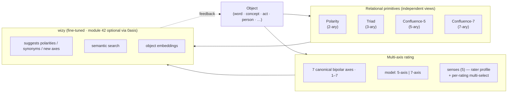
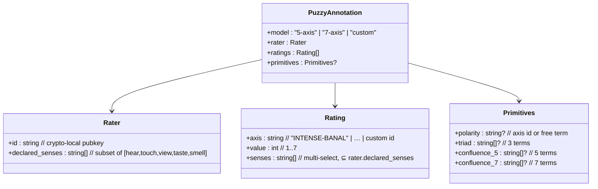

# ✺ flove · Puzzy engine

The relational annotation model — rating flove elements over canonical bipolar
axes (multi-axis · multi-rater · the 5 senses as a meta-rater). Promoted out of
`backend.md`; the `§8.x` labels are unchanged. It ships late (roadmap phase
**F5**, `backend.md` §9). Shallower view: `overview.md` §4.

---

## 8 · Puzzy engine

The puzzy engine is the part of flove that lets a rater express how an
object stands in relation to other objects, along several axes at
once, with sensory grounding and the option for several raters to
contribute distinct annotations.

### 8.1 · The seven canonical bipolar axes

The seven axes are **universal** — the same axes apply to every kind
of object. They are taken from the original `Puzzy/Relate/Rate`
prototype, now ported to `~/flove-demos/rate.html`:

| # | Left pole  | Mid (if any) | Right pole  |
|---|------------|--------------|-------------|
| 1 | INTENSE    | EQUAL        | BANAL       |
| 2 | SIMILAR    | COMPLEMENT   | DIFFERENT   |
| 3 | ABSTRACT   | —            | CONCRETE    |
| 4 | POSITIVE   | —            | NEGATIVE    |
| 5 | CLOSE      | —            | FAR         |
| 6 | PRIMARY    | —            | SECONDARY   |
| 7 | UNKNOWN    | —            | KNOWN       |

Each axis takes an integer **1–7**. Axes 1 and 2 carry a meaningful
mid-value; on the other five, 4 means "balanced / undecided". Users
may add custom axes; wizy suggests new axis pairs as the corpus
grows.

### 8.2 · 5-axis and 7-axis are different relational models

The two cardinalities are **distinct relational levels, not nested**: a
5-axis rating is *not* a 7-axis rating with two missing values. An
element is rated under exactly one model and the snapshot records
which one in `puzzy.model`. The reference UI exposes this as a
top-level toggle.

### 8.3 · Relational primitives — levels and views

Three primitives operate over the same object simultaneously, each at
a different relational cardinality and each presented as an
**independent view** in the common area:

| Primitive    | Cardinality | View question                                       |
|--------------|-------------|-----------------------------------------------------|
| Polarity     | 2-ary       | What is its opposite?                               |
| Triad        | 3-ary       | What three terms form a complete relational frame?  |
| Confluence   | 5- or 7-ary | What family of complementary opposites holds it?    |

Confluence at 5 and at 7 are **distinct levels** (mirroring §8.2).
**Combos** are explicitly **out of the standard**: each app may run
its own combinatorial generator over selected words, but combos are
not part of the inter-app schema.

### 8.4 · Senses — dual plane

The five senses (`hear · touch · view · taste · smell`) operate on
two planes at once:

1. **Rater profile.** Each rater declares the senses they relate to.
   This is a property of the rater, persisted alongside the
   `pubkey` in their identity.
2. **Per-rating meta-rater.** Inside any single rating, the rater
   multi-selects which of their declared senses informed *that*
   particular rating.

A sense the rater has not declared in their profile cannot be selected
on a rating; the reference UI dims those pills to make this visible.

### 8.5 · Multi-select within one rater

In flove, "multi-rater" means **multi-selection inside a single
rater's annotation** — multiple senses, multiple terms, multiple
confluence members. Each human contributes one and only one
annotation per element; aggregation across human raters in the common
area is **deferred** (see §8.8).

### 8.6 · `PuzzyAnnotation` schema

### 8.7 · Reference UI

`~/flove-demos/rate.html` is the canonical implementation:

- Pure-CSS tabs and pills (radio + `:checked`, checkbox + `:has`); JS
  is used only to render the live phrase and build the snapshot.
- Top-level toggle for 5-axis / 7-axis model.
- Rater profile bar declaring senses.
- Per-axis multi-select sense pills, dimmed for senses absent from the
  rater profile.
- Persisted and exported through the F0 layer (§10) with a custom
  snapshot that emits exactly the `PuzzyAnnotation` shape above.

### 8.8 · Open questions (specific to puzzy)

- **Aggregation across human raters** — what does the common area
  show when several people rate the same object? (yuxtaposition ·
  mean + dispersion · toggle). Decision deferred to F3 / F5.
- **Where the puzzy compute lives** — client-only / module-42-only /
  hybrid with offline cache. Deferred until F5 starts.
- **Which app fields admit free tags** — declared per-app in
  `mapping.json`; the canonical catalogue will be filled when each
  app ships its mapping (F1 deliverable).
